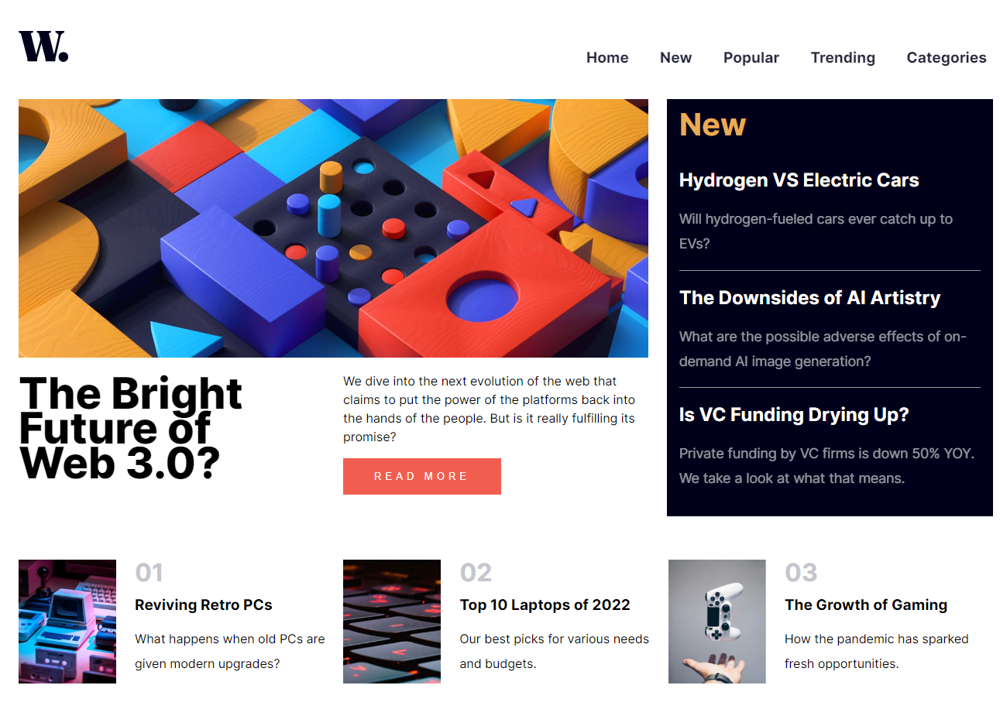

# Frontend Mentor - News homepage solution

This is a solution to the [News homepage challenge on Frontend Mentor](https://www.frontendmentor.io/challenges/news-homepage-H6SWTa1MFl).

## Table of contents

- [Overview](#overview)
  - [The challenge](#the-challenge)
  - [Screenshot](#screenshot)
  - [Links](#links)
- [My process](#my-process)
  - [Built with](#built-with)
  - [What I learned](#what-i-learned)
- [Author](#author)

## Overview

### The challenge

Users should be able to:

- View the optimal layout for the interface depending on their device's screen size
- See hover and focus states for all interactive elements on the page

### Screenshot

### Links

- [Solution URL](https://www.frontendmentor.io/solutions/news-homepage-solution-nHEvBMKwi3)
- [Live Site URL](https://news-homepage-frontend-mentor1.netlify.app)

## My process

### Built with

- Semantic HTML5 markup
- CSS custom properties
- Flexbox
- CSS Grid
- Mobile-first workflow

### What I learned

While this project was relatively easy, it became obvious that pre-planning the css grid is essential to avoid conflicts down the road.

In summary, while I started with a mobile-first template, when came the time to implement the css grid for the desktop version, the div and classes I had created brought more problems than they solved. I simplified all sections but will pay particular attention to this issue in the future.

## Author

- Website - [Kangkm](https://github.com/KangFennex)
- Frontend Mentor - [@KangFennex](https://www.frontendmentor.io/profile/KangFennex)
